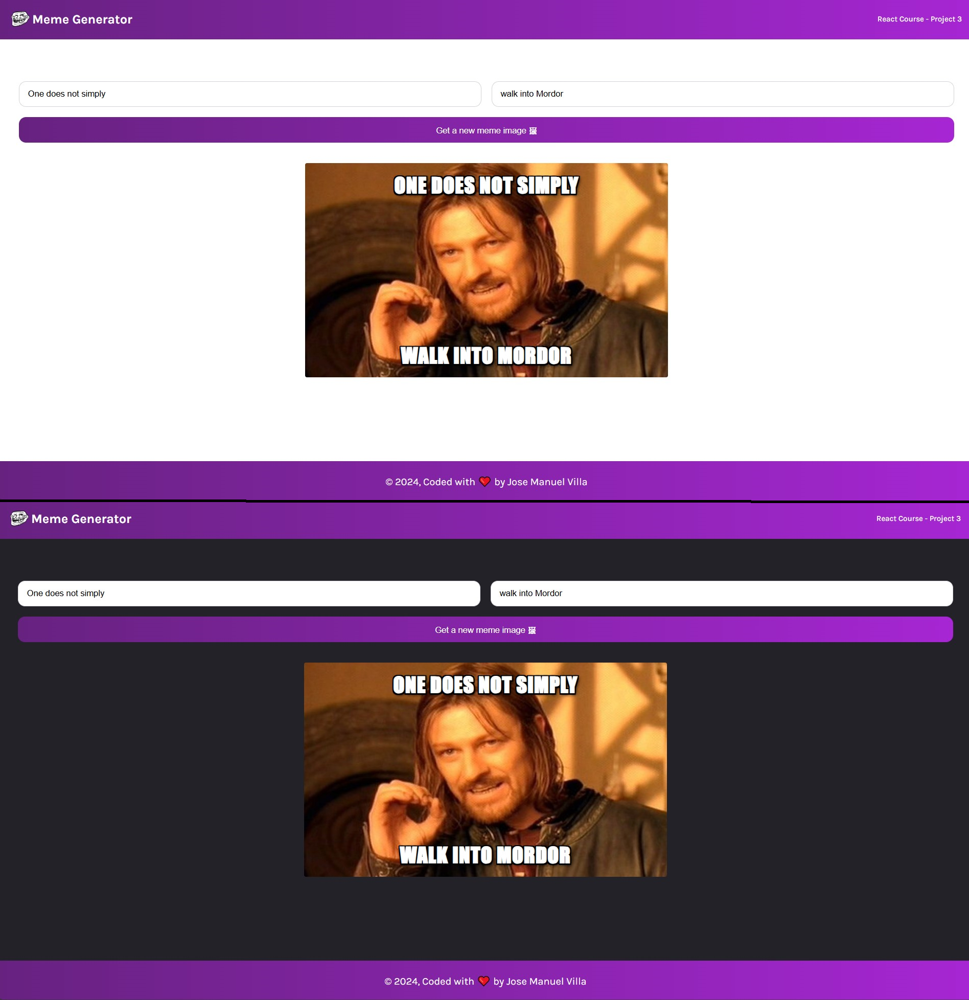

# Scrimba - Meme Generator
This is a solution to the Meme Generator project on [Scrimba](https://v2.scrimba.com/learn-react-c0e).

## Table of contents

- [Overview](#overview)
  - [Requirements](#requirements)
  - [Screenshot](#screenshot)
  - [Links](#links)
  - [Getting Started with Create React App](#getting-started-with-create-react-app)
- [My process](#my-process)
  - [Technologies used](#technologies-used)
  - [What I Learnt](#what-i-learnt)
- [Author](#author)

## Overview

### Requirements

<ul>
  <li>Get a random meme calling an API</li>
  <li>Update the text using an <code>onChange()</code> eventListener</li>
</ul>

### Screenshot
- Project view on a desktop device.

### Links
- Live Site: [@Netlify](https://traveljournal-jmvilla12.netlify.app/)
- Source Code: [@Github](https://github.com/jmvilla12/meme-generator)

### Getting Started with Create React App
This project was bootstrapped with [Create React App](https://github.com/facebook/create-react-app).

## My process

### Technologies used

- HTML5
- CSS
- React.JS

### What I Learnt

- Event listeners
- State
- Conditional rendering
- Forms
- Side effects

## Author
Jose Manuel Villa 
