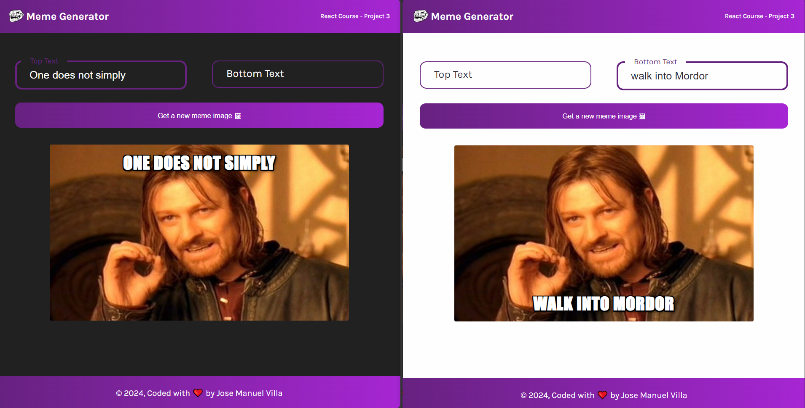

# Scrimba - Meme Generator
This is a solution to the Meme Generator project on [Scrimba](https://v2.scrimba.com/learn-react-c0e).

## Table of contents

- [Overview](#overview)
  - [Requirements](#requirements)
  - [Screenshot](#screenshot)
  - [Links](#links)
  - [Getting Started with Create React App](#getting-started-with-create-react-app)
- [My process](#my-process)
  - [Technologies used](#technologies-used)
  - [What I Learnt](#what-i-learnt)
- [Author](#author)

## Overview

### Requirements

<ul>
  <li>Get a random meme calling an API</li>
  <li>Update the text using an <code>onChange()</code> eventListener</li>
</ul>

### Screenshot
- Project view on a desktop device.


- View on a mobile device.


### Links
- Live Site: [@Netlify](https://memegenerator-jmvilla12.netlify.app)
- Source Code: [@Github](https://github.com/jmvilla12/meme-generator)

### Getting Started with Create React App
This project was bootstrapped with [Create React App](https://github.com/facebook/create-react-app).

## My process

### Technologies used

- HTML5
- CSS
- React.JS
  - Event listeners
  - State
  - Conditional rendering
  - Forms
  - Side effects

### What I Learnt
<ul>
  <li>Using <code>label</code> instead of <code>placeholder=""</code> allows dinamic animations</li>
</ul>

```jsx
/* The label must be after the input if you want to add dinamic animations  */
<div className='form--entry'>
  <input 
      type='text'
      className="form--input"
      name='topText' 
      id={id + '-topText'}
      onChange={handleChange}
      value={meme.topText}
      required
  />
  <label htmlFor={id + '-topText'} className='form--label'>Top Text</label>
</div>
```

<ul>
  <li>For the dinamic animations the use of pseudo-classes like <code>:focus</code> and <code>:valud</code> will be needed</li>
</ul>

```css
.form--input:focus, .form--input:valid {
  color: var(--color-text);
  border: 3.5px solid var(--color-base-dark);
}

.form--input:focus + .form--label,
.form--input:valid + .form--label {
  color: var(--color-base-dark);
  height: 30px;
  line-height: 30px;
  transform: translate(-0.5rem, -1.7rem) scale(0.75);
  z-index: 1111;
}
```


## Author
Jose Manuel Villa 
